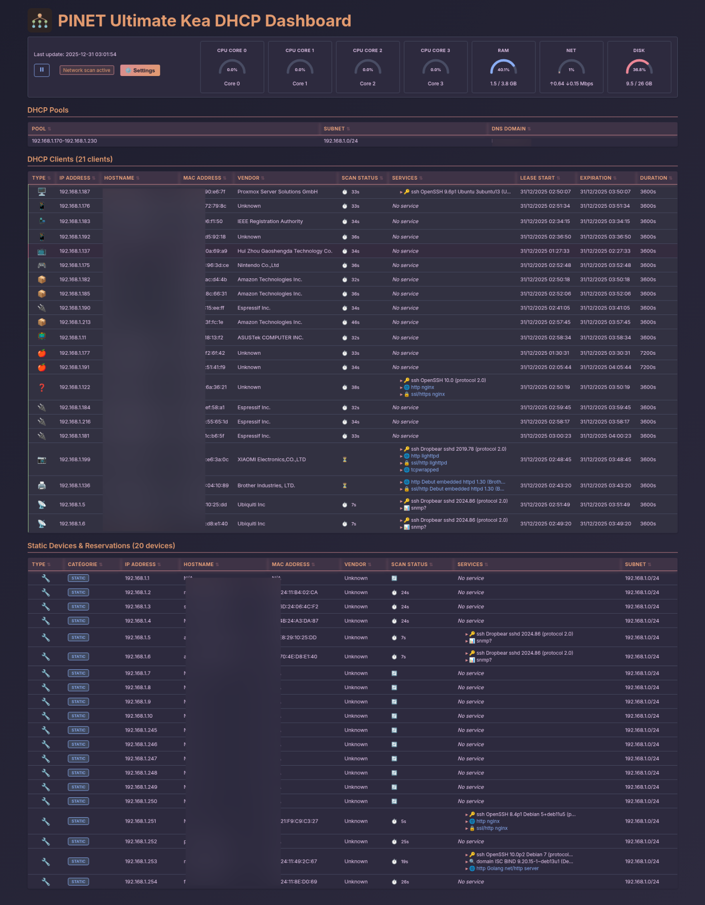

# Ultimate Kea DHCP Dashboard

> **Languages / Langues:** [🇬🇧 English](README.md) | [🇫🇷 Français](README.fr.md)

---

A modern, real-time web dashboard for monitoring ISC Kea DHCP server leases, pools, and network devices with advanced scanning capabilities and system metrics visualization.



## Features

### DHCP Monitoring
- Real-time DHCP lease tracking via Kea control socket
- Automatic pool and subnet configuration retrieval from Kea
- Pool utilization visualization
- Reserved IP management
- MAC address vendor identification (IEEE OUI database)
- Automatic hostname resolution

### Network Scanning & Discovery
- Active device discovery within and outside DHCP pools
- Multi-threaded network scanning for fast results (configurable thread pool)
- Comprehensive service detection (SSH, HTTP/HTTPS, SNMP, and more)
- **SNMP system information discovery** (sysDescr, sysContact, sysLocation, sysUpTime)
- **Configurable SNMP communities** for enhanced device interrogation
- Advanced device type identification with custom SVG icons
- Individual device and global scan control
- Real-time scan status monitoring

### System Metrics
- Real-time CPU, RAM, Network, and Disk usage
- Responsive gauge visualization
- Theme-aware color schemes
- Per-core CPU monitoring
- Live metrics updates (1-second refresh)

### Modern UI
- 6 professional themes (Ember, Twilight, Frost, Blossom, Clarity, Pulse)
- Custom SVG icon system with theme-aware colors
- Responsive design optimized for all screen sizes
- Real-time data updates without page reload
- Multi-language support (English, French, Spanish, German, Thai)
- Clean, intuitive interface with professional aesthetics

## Requirements

- Python 3.8+
- ISC Kea DHCP Server
- Linux system (multiple distributions supported)
- Root or sudo access for network scanning

### Supported Linux Distributions

- **Debian/Ubuntu** (APT)
- **Fedora/CentOS/RHEL/Rocky/AlmaLinux** (DNF/YUM)
- **Arch/Manjaro** (Pacman)
- **openSUSE/SLES** (Zypper)

See [Supported Distributions](docs/DISTRIBUTIONS.md) for detailed compatibility information.

## Quick Installation

### Method 1: Distribution Packages (Recommended)

Pre-built packages are available for major Linux distributions:

**Debian/Ubuntu:**
```bash
# Download the latest .deb package from releases
wget https://github.com/neyser/ultimate-kea-dashboard/releases/latest/download/ultimate-kea-dashboard_1.5.8-1_all.deb
sudo dpkg -i ultimate-kea-dashboard_*.deb
sudo apt-get install -f  # Install dependencies if needed
```

**Red Hat/Fedora/CentOS:**
```bash
# Download the latest .rpm package from releases
wget https://github.com/neyser/ultimate-kea-dashboard/releases/latest/download/ultimate-kea-dashboard-1.5.8-1.noarch.rpm
sudo dnf install ultimate-kea-dashboard-*.rpm
```

**Arch Linux:**
```bash
# Download the latest package from releases
wget https://github.com/neyser/ultimate-kea-dashboard/releases/latest/download/ultimate-kea-dashboard-1.5.8-1-any.pkg.tar.zst
sudo pacman -U ultimate-kea-dashboard-*.pkg.tar.zst
```

### Method 2: Self-Extracting Installer

Download and run the single self-contained installer:

```bash
# Download the installer
curl -sL https://github.com/neyser/ultimate-kea-dashboard/releases/latest/download/ultimate-kea-dashboard-installer.sh -o installer.sh

# Run it
sudo bash installer.sh
```

### Method 3: Direct Install Script

```bash
# Clone and install
git clone https://github.com/neyser/ultimate-kea-dashboard.git
cd ultimate-kea-dashboard
sudo bash install.sh
```

## Manual Installation

1. Clone the repository:
```bash
git clone https://github.com/username/ultimate-kea-dashboard.git
cd ultimate-kea-dashboard
```

2. Install dependencies (distribution-specific):

**Debian/Ubuntu:**
```bash
sudo apt-get update
sudo apt-get install -y python3 python3-pip nmap arping net-tools python3-psutil
# Optional for advanced features:
sudo apt-get install -y snmp avahi-utils
```

**Fedora/RHEL/CentOS:**
```bash
sudo dnf install -y nmap iputils python3 python3-pip net-tools python3-psutil
# Optional for advanced features:
sudo dnf install -y net-snmp-utils avahi-tools
```

**Arch/Manjaro:**
```bash
sudo pacman -S nmap iputils python python-pip net-tools python-psutil
# Optional for advanced features:
sudo pacman -S net-snmp avahi
sudo systemctl enable --now avahi-daemon
```

**openSUSE:**
```bash
sudo zypper install nmap iputils python3 python3-pip net-tools python3-psutil
# Optional for advanced features:
sudo zypper install net-snmp avahi-utils
```

**Note**: 
- **psutil** is installed via system package manager (recommended method)
- Using system packages avoids conflicts with pip and respects PEP 668
- Optional packages enable SNMP queries and mDNS discovery
- See [Dependencies](docs/DEPENDENCIES.md) for details

3. Configure the dashboard:
```bash
sudo cp etc/ultimate-dashboard.conf.example etc/ultimate-dashboard.conf
sudo nano etc/ultimate-dashboard.conf
```

4. Run the dashboard:
```bash
sudo python3 bin/ultimate-dashboard
```

Or install as a systemd service:
```bash
sudo ./install.sh
```

3. Configure the dashboard:
```bash
sudo cp etc/ultimate-dashboard.conf.example etc/ultimate-dashboard.conf
sudo nano etc/ultimate-dashboard.conf
```

4. Run the dashboard:
```bash
sudo python3 bin/ultimate-dashboard
```

Or install as a systemd service:
```bash
sudo ./install.sh
```

## Configuration

Edit `/etc/ultimate-dashboard/ultimate-dashboard.conf`:

```ini
[DEFAULT]
# Server settings
port = 8089
ssl_enabled = true

# Kea integration (simplified - no manual subnet/pool configuration needed!)
kea_config = /etc/kea/kea-dhcp4.conf
kea_socket = /run/kea/kea4-ctrl-socket

# Scanning
scan_threads = 50
scan_timeout = 0.5

# SNMP Discovery (optional)
snmp_enabled = true
snmp_communities = public,home
snmp_timeout = 1
```

**Key Improvements:**
- **Automatic Configuration**: Subnet, pool, and DHCP range information is automatically retrieved from Kea via the control socket
- **No Manual Network Config**: No need to manually specify subnets or DHCP ranges
- **Socket-First Architecture**: Uses Kea control socket for real-time data, lease file only as fallback
- **Simplified Setup**: Just point to your Kea config and socket, and you're ready to go!

## Screenshots

The dashboard provides a comprehensive view of your DHCP infrastructure:


Features shown:
- **Real-time System Metrics**: CPU per-core, RAM, Network, and Disk usage with animated gauges
- **DHCP Pools**: Automatic detection from Kea configuration with subnet and DNS domain info
- **Active DHCP Leases**: Live clients with custom device-type icons, hostname resolution, MAC vendor lookup, and comprehensive service detection
- **Static Devices & Reservations**: Network devices outside DHCP pools and DHCP reservations tracked separately
- **Advanced Service Discovery**: Automatic detection of SSH, HTTP, HTTPS, SNMP, and more with service-specific icons
- **Theme Support**: 6 professional color schemes with theme-aware SVG icons
- **Multi-language**: French, English, Spanish, German, Thai with complete translation coverage
- **Real-time Updates**: All data refreshes automatically without page reload (1s refresh for metrics, configurable for scans)

## Usage

Access the dashboard at:
- HTTPS: `https://your-server-ip:8089`
- HTTP: `http://your-server-ip:8089` (if SSL disabled)

### Controls

- **Global Scan Control**: Pause/resume all network scans from the header
- **Individual Scan Control**: Pause/resume scanning for specific devices
- **Theme Selector**: Choose from 5 professional themes
- **Auto-refresh**: Configurable refresh interval (default: 30s)

## Architecture

```
ultimate-kea-dashboard/
├── bin/
│   └── ultimate-dashboard          # Main application
├── lib/
│   ├── themes.py                   # Theme definitions
│   ├── stats.py                    # System metrics
│   ├── network_scanner.py          # Network scanning logic
│   ├── device_detection.py         # Device type detection
│   └── mac_vendor.py               # MAC vendor lookup
├── static/
│   └── js/
│       └── gauges.js               # Gauge visualization
├── data/
│   └── oui.json                    # IEEE OUI database
└── etc/
    └── ultimate-dashboard.conf.example
```

## Security Considerations

- SSL/TLS encryption enabled by default
- Configuration file should be readable only by root
- No default passwords or credentials
- Network scanning requires appropriate permissions

## Performance

- Multi-threaded scanning (configurable thread pool)
- Efficient caching mechanisms
- Minimal resource footprint
- Optimized for networks with 100+ devices

## Troubleshooting

### Dashboard not starting
```bash
# Check logs
sudo journalctl -u ultimate-dashboard -f

# Verify configuration
sudo python3 -c "import configparser; c=configparser.ConfigParser(); c.read('/etc/ultimate-dashboard/ultimate-dashboard.conf'); print('Config OK')"
```

### Scans not working
```bash
# Ensure required tools are installed
which nmap arping

# Check permissions
sudo -v
```

### Empty MAC addresses
- Ensure ARP table is populated (ping devices first)
- Run dashboard with sudo/root privileges
- Check network interface permissions

## Contributing

Contributions are welcome! Please see [CONTRIBUTING.md](CONTRIBUTING.md) for guidelines.

## License

MIT License - see [LICENSE](LICENSE) for details.

## Changelog

See [CHANGELOG.md](CHANGELOG.md) for version history.

## Author

Created and maintained by username.

## Acknowledgments

- ISC Kea DHCP Server team
- IEEE for OUI database
- Netdata for UI inspiration
